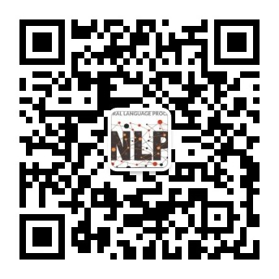

---

title: 首页

nav:

 order: 1

 tooltip: 主页

---

# 宁波东方理工大学自然语言处理课题组

我们是[宁波东方理工大学](https://www.eitech.edu.cn/)自然语言处理课题组（EIT-NLP）。依托的宁波东方理工大学，坐落于孕育过王阳明、黄宗羲等思想大家与屠呦呦等科学大师的宁波 —— 这座东南沿海的港口名城与历史文化之城。学校以 “服务国家发展、推动社会进步” 为使命，是一所社会力量举办、省市共同建设、国家重点支持的高起点、小而精、创新型、国际化的新型研究型大学。



## 新闻





## About us

We are the Natural Language Processing Group (NLP), Eastern institute of technology (EIT), Ningbo. Ningbo is a major port city and historical cultural center on China's southeastern coast. The institute is committed to gathering top global talent and aims to establish itself as a high-level, innovative, and international research university. Its goal is to become a world-class academic institution in the short term and lead the development of key strategic disciplines in the country. The institute promotes an academic environment of equality, openness, and freedom, with the ambition of becoming a nonprofit, cutting-edge research institution driving transformative research.

At the NLP group, we align with EIT's mission to drive transformative research. Our work focuses on advancing natural language processing through innovative approaches that enable machines to deeply understand, generate, and reason with human language. We tackle diverse areas such as information retrieval, multi-modal learning, and chain-of-thought reasoning. A core objective is to develop highly efficient algorithms that deliver state-of-the-art performance while minimizing computational and resource demands. We prioritize reducing dependence on large-scale human annotation, speeding up training processes, and cutting down inference costs, ultimately aiming to create robust, resource-efficient models that are accessible and effective across a wide range of applications.

For more updates, follow us on our official WeChat public account: EIT-NLP.

    



## Github

    Our lab focus on open science and will release our code, model and dataset at
    <a href="https://github.com/eit-nlp" target="_blank" style="display: inline-block; padding: 10px 20px; border: 2px solid #007acc; border-radius: 5px; text-decoration: none; color: #007acc; font-weight: bold; text-transform: uppercase; white-space: nowrap;">VISIT OUR GITHUB</a>

